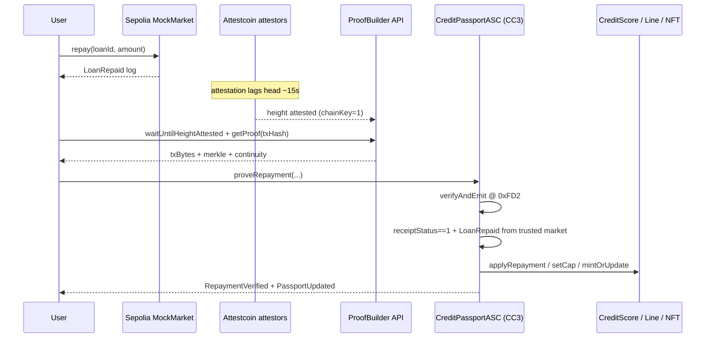

# Architecture

## Overview

## Packages

| Path | Role |
| --- | --- |
| `packages/contracts-sepolia` | Emit unambiguous `LoanRepaid` |
| `packages/contracts-creditcoin` | Verify proofs; own score/cap/NFT state |
| `packages/worker` | CLI proof generation (`@gluwa/usc-sdk`) |
| `apps/web` | Dual-chain desk + `/api/prove` |

## ASC security checks

1. `chainKey == 1` (Sepolia on CC3 testnet)
2. `verifyAndEmit` returns true
3. Replay: `processedQueries[keccak256(chainKey, height, txIndex)]`
4. `EvmV1Decoder` → `receiptStatus == 1`
5. Log signature `LoanRepaid(address,uint256,uint256,uint256,uint64)`
6. `log.address == sepoliaMockMarket` (immutable)
7. `log.borrower == msg.sender` (or explicit claim address equal to msg.sender)

## Official dependencies

- `@gluwa/asc-contracts` — `EvmV1Decoder`, `INativeQueryVerifier`
- `@gluwa/usc-sdk` — `ProofBuilder`, `PrecompileChainInfoProvider`
